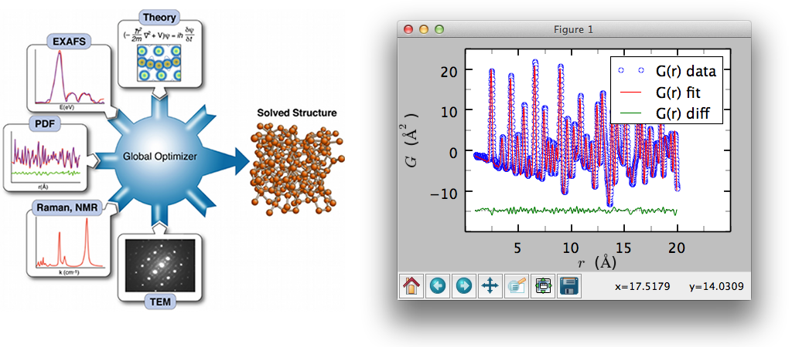
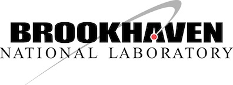
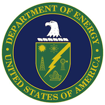

.. sphinxTestRun documentation master file, created by
   sphinx-quickstart on Fri Nov  8 15:28:37 2013.
   You can adapt this file completely to your liking, but it should at least
   contain the root `toctree` directive.

.. _home:

.. raw:: html

   <strong>
   Please update your PDFgui to PDFgui v2.0, the first Python 3 version of the software (May 10, 2023)
   </strong>
   &nbsp;
   <a href="products/pdfgui.html" class="btn btn-large btn-success btn-flat">Get PDFgui v2.0</a>
   &nbsp;
   <a href="acknowledgements.html">Credits</a>

DiffPy - Atomic Structure Analysis in Python
============================================
A free and open source software project to provide python software for
diffraction analysis and the study of the atomic structure of materials.

.. image:: images/blank1x1.png

.. include:: abbreviations.txt

DiffPy is the home of the |DiffPyCMI|
Complex Modeling framework, a modular software framework for robust and extensible
modeling of diffraction data.  We welcome contributions to this project from the
community.

The project is currently centered at `Brookhaven National Laboratory`_, a US `Department of
Energy, Office of Basic Energy Sciences`_ funded laboratory.
Many parts of the code were developed under the diffraction part of the DANSE_ project,
a software construction project funded by the `National Science Foundation`_ to provide
data analysis software tools for neutron scattering experiments.  This project was previously
centered at Columbia University and, before that, Michigan State University.

.. _danse: http://danse.us/

.. _national science foundation: https://www.nsf.gov/

.. _department of energy, office of basic energy sciences: https://science.energy.gov/bes/

.. _brookhaven national laboratory: https://www.bnl.gov/

.. image:: images/blank1x1.png
   :align: left
   :height: 10

.. toctree::
   :hidden:

   community
   publications
   NSFnugget
   acknowledgements
   products/diffpycmi/index
   products/diffpycmi/install
   products/diffpycmi/contents
   products/diffpycmi/cmi_exchange
   products/diffpycmi/license
   products/diffpycmi/updatesources
   products/diffpycmi/contributecode
   products/xPDFsuite
   products/pdfgui
   products/pdfgetx
   products/pythonpackages
   products/SrMise
   products/mPDF
   products/xinterpdf
