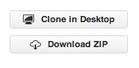

CMI Exchange
=============

The `CMI Exchange`_ is a collection of community developed scripts,
functions, and IPython plugins that make use of the DiffPy.CMI
framework. If you are new to DiffPy.CMI it is a great place to get
started.  If you've been working with DiffPy.CMI for a while and feel
that others would benefit from seeing your code please contribute!

.. _cmi exchange: https://github.com/diffpy/cmi_exchange#cmi-exchange

.. _new_users:

For New Users
-------------

Begin by visiting the `CMI Exchange on github
<https://github.com/diffpy/cmi_exchange#cmi-exchange>`_.  As with all
github projects you will see the following two buttons in the sidebar
allowing you to clone the project in your desktop or download a zip
file:

For now simply follow the download zip link to get the entire project
and unpack the zip file to a convenient location on your machine.  If
you have correctly installed the |DiffPyCMI| package you
can start running the scripts right away. Just follow the instructions
in `New User Tips
<https://github.com/diffpy/cmi_exchange#new-user-tips>`_.

You'll notice that there are two directories: ``cmi_plugins`` and
``cmi_scripts``.  The scripts are standalone python scripts that can be
run directly from the `IPython`_ command line, whereas the plugins are a
set of functions and  `IPython extensions`_
that provide additional functionality to your IPython session.

Scripts
^^^^^^^

To run a script, simply navigate to the directory containing the .py
file and type::

    $ ipython --pylab
    In [1]: %run script_name.py

Extensions
^^^^^^^^^^

`IPython extensions`_ are importable IPython modules that can modifpy
the behavior of the shell to add functionality.  They are installed and
activated from the IPython command line by running::

    In [1]: %install_ext name_of_extension.py
    In [2]: %load_ext name_of_extenstion

.. _ipython: http://ipython.org/

.. _ipython extensions: http://ipython.org/ipython-doc/rel-0.12.1/config/extensions/index.html

.. _contribute_scripts:

Contribute Scripts
------------------

To contribute your own script to the CMI Exchange you must first fork
the project on github.  Once you've added your own code you can issue a
pull request.

If you're new to git and don't know what it means to fork a project
`begin here <https://help.github.com/articles/fork-a-repo>`_.

.. include:: ../../abbreviations.txt
