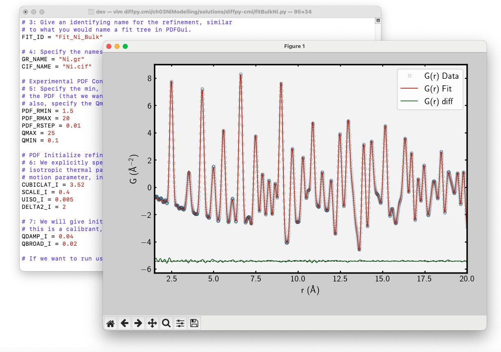

##########
DiffPy-CMI
##########

DiffPy-CMI is our complex modeling framework. It is a highly flexible
library of Python modules for robust modeling of nanostructures in
crystals, nanomaterials, and amorphous materials.

The software provides functionality for storage and manipulation of
structure data and calculation of structure-based quantities, such as
PDF, SAS, bond valence sums, atom overlaps, bond lengths, and
coordinations. Most importantly the DiffPy-CMI package contains a
fitting framework for combining multiple experimental inputs in a single
optimization problem.

This is an early release of code that is under intense development, with
support for installation on Unix, Linux, and Macintosh machines.  The
scope and documentation of the project will evolve rapidly, but we want
to make the code available at the earliest possible date. Please make
use of the software and provide feedback and suggestions for
improvement, but please be patient and check back frequently for
updates.

Installation
============

Use of this software is subject to the conditions in
:doc:`LICENSE.txt <license>`.

As of version 2.0 DiffPy-CMI is available for Linux and
Mac as a collection of packages for Anaconda Python.  As
a first step download and install **Anaconda for Python 2.7**
from |anaconda-download|.

.. note::
   If you already have Anaconda for Python 3.5, create a separate
   Anaconda environment *py27* which will provide Python 2.7
   instead of 3.5.  Make sure that *py27* environment is activated
   when working with DiffPy-CMI.  ::

      conda create --name=py27 python=2.7
      source activate py27

Once Anaconda is ready, DiffPy-CMI can be installed from the "diffpy"
channel of Anaconda packages as follows ::

   conda config --add channels diffpy
   conda install diffpy-cmi

The software distribution over Anaconda makes it easy to publish
frequent software updates.  To update your installation later use ::

   conda update diffpy-cmi

If you don't want to use Anaconda you can
:doc:`install DiffPy-CMI from sources <install>`.  Note that
this method takes more time and requires more experience
with the operating system.

What next?
==========

* `Explore CMI exchange
  <https://github.com/diffpy/cmi_exchange#cmi-exchange>`__,
  our collection of example scripts and tutorials

* :doc:`Get tips on using the CMI exchange <cmi_exchange>`

* :doc:`Contribute code <contributecode>`

Documentation
=============

Documentation for packages developed by the DiffPy team is available
at the links below.

* diffpy.srfit_ -- configuration and control of data-fitting problems
* diffpy.srreal_ -- calculators for pair distribution function, bond
  valence sums, etc.
* diffpy.Structure_ -- light-weight representation of crystal
  structures
* pyobjcryst_ -- Python interface to ObjCryst++ crystallographic
  library
* diffpy.utils_ -- general purpose utilities for the diffpy libraries
* libdiffpy_ - C++ library for calculation of PDF and other real-space
  quantities

.. _diffpy.srfit: ../../doc/srfit/

.. _diffpy.srreal: ../../doc/srreal/

.. _diffpy.Structure: ../../doc/structure/

.. _diffpy.utils: ../../doc/utils/

.. _pyobjcryst: ../../doc/pyobjcryst/

.. _libdiffpy: ../../doc/libdiffpy/

See :ref:`DiffPy-CMI contents <contents>` for a complete list
of open-source libraries that are included in DiffPy-CMI and
their respective project pages.

Reference
=========

If you use this software in a research work which leads to publication,
we ask you to acknowledge the use of DiffPy-CMI by citing the following
paper:

* |citeJuhasAca15|

.. include:: ../../abbreviations.txt
