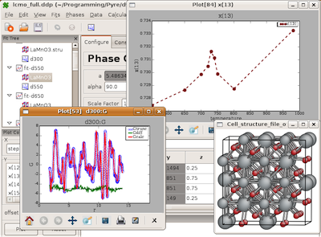

.. highlight:: bash
.. include:: ../abbreviations.txt

######
PDFgui
######

Overview
========

For users who do not have the expertise or necessity for command line analysis, PDFgui is
a convenient and easy to use graphical front end for the PDFfit2 refinement program. It is
capable of full-profile fitting of the atomic pair distribution function (PDF)
derived from x-ray or neutron diffraction data
and comes with built in graphical and structure visualization capabilities.

PDFgui is also included in :doc:`xPDFsuite <xPDFsuite>`,
a powerful end-to-end software for X-ray PDF analysis.
xPDFsuite is designed for flexible,
high throughput PDF analyses and contains many features for interrogating, comparing and
modeling data as well as simply doing data reduction.

   Screen-shot of PDFgui during a refinement of multiple data-sets

Installation
============

By downloading and using this software you are agreeing to the
conditions specified in the :doc:`software license <pdfguilicense>`.

PDFgui is distributed as a software package for
`Anaconda Python <https://www.continuum.io>`__.  PDFgui is available
for all operating systems supported by Anaconda, namely for
Linux, Mac OS X, and Windows.

As a prerequisite for PDFgui installation, download and
install **Anaconda Python** from
|anaconda-download|.

.. TODO -- remove when PDFgui is compatible with wxpython 4

.. important::

   As of July 2019 Anaconda stopped providing older versions
   of several packages that are required by PDFgui
   (details `here
   <https://www.anaconda.com/why-we-removed-the-free-channel-in-conda-4-7>`__).
   We are working on making PDFgui compatible with the current
   set of Anaconda packages.
   In the meantime you must re-activate the old packages
   as follows ::

      conda update -n base conda
      conda config --set restore_free_channel true

PDFgui is available from the "diffpy" channel of Anaconda packages.
Because PDFgui requires Python 2.7 and wxpython 3,
it is strongly recommended to install it in a dedicated
Anaconda environment *py27*.
To do so open a *Terminal* window or *Anaconda Command Prompt* on Windows
and use the :program:`conda` command as follows ::

   conda config --add channels diffpy
   conda create --name=py27 python=2.7
   conda activate py27
   conda install "diffpy.pdfgui>=1.1.2"

All done.  To start PDFgui enter :program:`pdfgui` command in a
Terminal or use the *DiffPy* start menu on Windows.  PDFgui can be
also started from the *Launcher* application included with Anaconda.

.. note::
   To start PDFgui from a Terminal make sure *py27* is
   the active Anaconda environment::

      conda activate py27

   Alternatively you can add the following line to your shell startup
   file :file:`.bashrc` to define an alias which will work in
   any Anaconda environment ::

      alias pdfgui="/path/to/py27/bin/pdfgui"

   where ``/path/to`` needs to be adjusted according to the output of
   ``which pdfgui`` command.

PDFgui updates
==============

The Anaconda package system makes it easy to prepare and distribute
software updates and bugfixes.  To update to the latest version of
PDFgui use ::

   conda update --channel=diffpy diffpy.pdfgui

To use a bleeding edge development version, visit the project source
repository at https://github.com/diffpy/diffpy.pdfgui and consult
its README file.

Other versions
==============

When Anaconda Python is not available, PDFgui can be installed from
sources.  The latest source package is at the `Python Package
Index <https://pypi.python.org/pypi/diffpy.pdfgui>`__ and the
prior versions are at
https://github.com/diffpy/diffpy.pdfgui/releases.  See the `README
<https://github.com/diffpy/diffpy.pdfgui#pdfgui>`__ document
for further details on installation from sources,

Finally, here are the previous single-file installers.  Although
quite outdated, they might be handy if there is some problem with
Anaconda or if one needs to install without Internet connection.

======================== ================== ============ =====================================
Name                     Date               Size         Description
======================== ================== ============ =====================================
`diffpy-1.0-r3067.exe`_	 2009-04-10         21.5 M       Windows self extracting installer
`diffpy-1.0-r3067.tgz`_	 2009-04-10         6.4 M        Linux and Mac tarball
======================== ================== ============ =====================================

.. _diffpy-1.0-r3067.exe:
   https://github.com/diffpy/diffpy.pdfgui/releases/download/svn3067/diffpy-1.0-r3067.exe
.. _diffpy-1.0-r3067.tgz:
   https://github.com/diffpy/diffpy.pdfgui/releases/download/svn3067/diffpy-1.0-r3067.tgz

MD5 check sums for these installer files are available
`here <https://github.com/diffpy/diffpy.pdfgui/releases/svn3067>`__.

Documentation and help
======================

*  The user manual is available in `HTML <../doc/pdfgui/index.html>`__
   and `PDF <../doc/pdfgui/pdfgui.pdf>`__ formats.

*  Tutorial files are available from
   `pdfgui-tutorial.zip <../doc/pdfgui/pdfgui-tutorial.zip>`__.

*  Please, join the :doc:`community forum <../community>` for tips, tricks, and feedback.

.. toctree::
   :hidden:

   pdfguilicense
