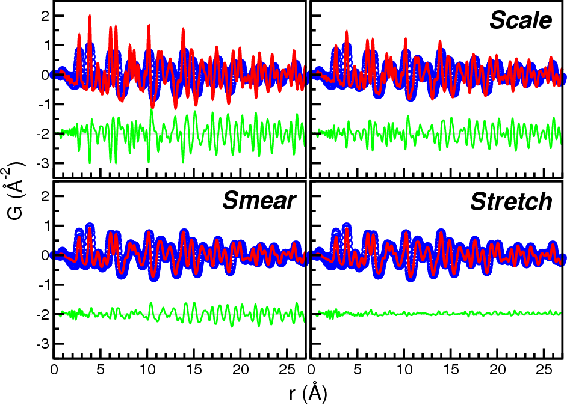

.. include:: ../abbreviations.txt

########
PDFmorph
########

Overview
========

.. note::

	PDFmorph is currently run from the command line, which requires
	opening and typing into a terminal window or Windows command
	prompt. It is recommended that you consult online resources and
	become somewhat familiar before using PDFmorph.

PDFmorph is a Python software package designed to increase the insight
researchers can obtain from measured atomic pair distribution functions
(PDFs) in a model-independent way. The program was designed to help a
researcher answer the question: "Has my material undergone a phase
transition between these two measurements?"

PDFmorph makes use of several data manipulation techniques to correct
for benign effects such as thermal expansion (peak shift) and increased
thermal motion (peak broadening) or a cahnge in scale due to differences
in incident flux, for example. PDFmorph will do its best to correct
for these benign effects before computing and plotting a difference
curve.

One PDF (typically that collected at higher temperature) is identified
as the "target" PDF and the second is "morphed" by "stretching" (changing
the r-axis to simulate a uniform lattice expansion), "smearing"
(broadening peaks through a uniform convolution to simulate increased
thermal motion), and "scaling" (self-explanatory). PDFmorph will vary
amplitude of morphing transformations to obtain the best fit between
morphed and target PDFs, then plot them along with the difference curve
plotted below.

There are also a few other morphing transformations in the program.

Finally, we note that PDFmorph should work on other spectra that are
not PDFs, though it has not been extensively tested beyond the PDF.

.. PDFmorph will soon be included in :doc:`xPDFsuite <xPDFsuite>`, a powerful end-to-end software for X-ray PDF analysis. xPDFsuite is designed for flexible, high throughput PDF analyses and contains many features for interrogating, comparing, and modeling data as well as simply doing data reduction.

	Transformation techniques (scale, smear, and stretch, respectively)
	utilized by PDFmorph applied sequentially on an NaCl sample

Installation
============

By downloading and using this software, you are agreeing to the conditions
specified in the :doc:`software license <pdfmorph_license>`.

PDFmorph will run on Python 2.7 or higher, but here we give instructions
for installing the Python 3 version in a conda environment.

.. note::
	PDFmorph is distributed and best installed using conda. It should
	run in most Python 3 environments and can be directly installed
	in an existing environment (using the commands listed below). If
	you do not currently have conda installed, here are some
	lightweight instructions for getting started:

		1.) Download and install *Anaconda* or *mini-conda* from
		`continuum <https://www.continuum.io>`__.

		2.) Create a Python 3 environment with the command ::
		
			conda create --name=<env_name> python=3

	You can give the environment any name you like.
	You only need to create the environment once, but every time you
	want to use PDFmorph you will have to reactivate the environment
	in which it is installed by opening a terminal and typing ::
	
		source activate <env_name>

	on Mac/Linux, or ``activate <env_name>`` on Windows.

Once you're in your desired conda environment, you can install PDFmorph
from either the ``diffpy`` or ``conda-forge`` channels of Anaconda packages
by running opening a *Terminal* window or *Command Prompt*
on Windows and using the :program:`conda` command ::

	conda config --add channels conda-forge
	conda install diffpy.pdfmorph

If you prefer to install from the diffpy channel, simply replace
``conda-forge`` with ``diffpy`` in the commands above.

By then it should be installed! To make sure that installation has
completed correctly, run the following command from your PDFmorph-equipped
conda environment ::

	pdfmorph --version

This command should return the version of PDFmorph you have on your
machine.

PDFmorph Updates
================

The Anaconda package system makes it easy to prepare and distribute
software packages and bugfixes. To update the latest version of PDFmorph,
use ::

	conda update diffpy.pdfmorph

With other Python distributions, the program can be updated to the
latest version with ::

	easy_install --upgrade diffpy.pdfmorph

To use a development version, visit the project source repository at
https://github.com/diffpy/diffpy.pdfmorph and consult its README file.

Documentation/Help
==================

0.1.0 - latest
----------------------

* User manual (available in HTML and PDF)
* Installation instructions
* `Sample PDF files <https://github.com/diffpy/diffpy.pdfmorph/tree/master/tests/testdata>`__
* Tutorial
* Please, join the :doc:`community forum <../community>` for tips,
  tricks, and feedback.

.. References// # update upon paper resease

.. toctree::
    :hidden:

    pdfmorph_license
