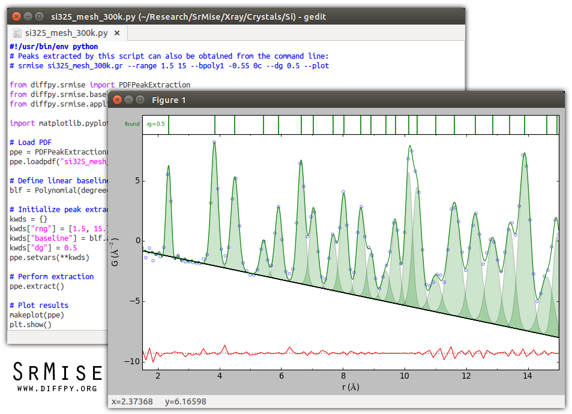

##########
Utils
##########

.. include:: ../abbreviations.txt

General utilities for analyzing diffraction data

The diffpy.utils package provides a number of functions and classes designed to help
researchers analyze their diffraction data.  It also includes some functionality for
carrying out PDF analysis.  Examples are parsers for reading common format diffraction
data files, ``DiffractionObjects`` that allow you to do algebra on diffraction patterns,
tools for better capture and propagation of metadata,
diffraction-friendly interpolation routines, as well as some other tools used across
diffpy libraries.

This is an alpha release of SrMise, and the capabilities and documentation of
the project will evolve.  In particular, the multimodeling API is expected to
change significantly in a future version.  The DiffPy team encourages
investigators to use the software even at this early stage, and invites
feedback and suggestions.

Citation
--------

If you use this program for a scientific research that leads
to publication, we ask that you acknowledge use of the program
by citing the following paper in your publication:

   P. Juhás, C. L. Farrow, X. Yang, K. R. Knox and S. J. L. Billinge,
   `Complex modeling: a strategy and software program for combining
   multiple information sources to solve ill posed structure and
   nanostructure inverse problems
   <http://dx.doi.org/10.1107/S2053273315014473>`__,
   *Acta Crystallogr. A* **71**, 562-568 (2015).

Documentation
-------------

Documentation may be found at, https://diffpy.github.io/diffpy.utils

Installation
------------

The preferred method is to use `Miniconda Python
<https://docs.conda.io/projects/miniconda/en/latest/miniconda-install.html>`_
and install from the "conda-forge" channel of Conda packages.

To add "conda-forge" to the conda channels, run the following in a terminal. ::

        conda config --add channels conda-forge

We want to install our packages in a suitable conda environment.
The following creates and activates a new environment named ``diffpy.utils_env`` ::

        conda create -n diffpy.utils_env diffpy.utils
        conda activate diffpy.utils_env

To confirm that the installation was successful, type ::

        python -c "import diffpy.utils; print(diffpy.utils.__version__)"

The output should print the latest version displayed on the badges above.

If the above does not work, you can use ``pip`` to download and install the latest release from
`Python Package Index <https://pypi.python.org>`_.
To install using ``pip`` into your ``diffpy.utils_env`` environment, type ::

        pip install diffpy.utils

If you prefer to install from sources, after installing the dependencies, obtain the source archive from
`GitHub <https://github.com/diffpy/diffpy.utils/>`_. Once installed, ``cd`` into your ``diffpy.utils`` directory
and run the following ::

        pip install .

Getting Started
---------------

You may consult our `online documentation <https://diffpy.github.io/diffpy.utils>`_ for tutorials and API references.

Support and Contribute
----------------------

`Diffpy user group <https://groups.google.com/g/diffpy-users>`_ is the discussion forum for general questions and discussions about the use of diffpy.utils. Please join the diffpy.utils users community by joining the Google group. The diffpy.utils project welcomes your expertise and enthusiasm!

If you see a bug or want to request a feature, please `report it as an issue <https://github.com/diffpy/diffpy.utils/issues>`_ and/or `submit a fix as a PR <https://github.com/diffpy/diffpy.utils/pulls>`_. You can also post it to the `Diffpy user group <https://groups.google.com/g/diffpy-users>`_.

Feel free to fork the project and contribute. To install diffpy.utils
in a development mode, with its sources being directly used by Python
rather than copied to a package directory, use the following in the root
directory ::

        pip install -e .

To ensure code quality and to prevent accidental commits into the default branch, please set up the use of our pre-commit
hooks.

1. Install pre-commit in your working environment by running ``conda install pre-commit``.

2. Initialize pre-commit (one time only) ``pre-commit install``.

Thereafter your code will be linted by black and isort and checked against flake8 before you can commit.
If it fails by black or isort, just rerun and it should pass (black and isort will modify the files so should
pass after they are modified). If the flake8 test fails please see the error messages and fix them manually before
trying to commit again.

Improvements and fixes are always appreciated.

Before contributing, please read our `Code of Conduct <https://github.com/diffpy/diffpy.utils/blob/main/CODE-OF-CONDUCT.rst>`_.

Contact
-------

For more information on diffpy.utils please visit the project `web-page <https://diffpy.github.io/>`_ or email Simon Billinge at sb2896@columbia.edu.

What next?
============

Explore the SrMise
`tutorial <https://www.diffpy.org/diffpy.utils/>`_!

.. toctree::
   :hidden:

   Utilslicense
