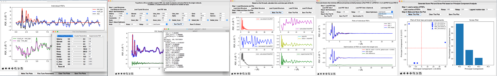

##########
xINTERPDF
##########

xINTERPDF is a Python GUI program for analyzing X-ray pair distribution function (PDF) data of organic compounds collected at synchrotron and/or laboratory X-ray sources. It uses DiffPy-CMI as a backend for simulation of PDFs. Currently it supports (1) The study of intermolecular interaction (e.g. hydrogen bonds) by subtracting out the scattering signal(s) of single molecule(s) in real space. (2) The PDF model fit of the crystalline organic compound using the method proposed by Prill et al. (*J. Appl. Cryst.*, **48**, 171-178, 2015.) (3) The phase quantification of physical mixtures of organics. (4) Generate Score/Scree plots based on Principle Component Analysis (PCA).

A video demo about installation and usage is available at `https://www.youtube.com/watch?v=lAFZ5VYEH1g <https://www.youtube.com/watch?v=lAFZ5VYEH1g>`__. The code for xINTERPDF is hosted at `GitHub page <https://github.com/curieshicy/xINTERPDF>`__.

This is a first release of the program (v.0.1.0). Comments and suggestions are welcome. Please send an email to Chenyang Shi at cs3000@columbia.edu and/or post your questions at diffpy-users Google Groups. 

Getting Started
=================

The xINTERPDF package requires Python 2.7 and the following dependency packages:

* ``NumPy`` - Numerical mathematics and fast array operations for Python
* ``SciPy`` - Scientific libraries for Python
* ``matplotlib`` - Python plotting library
* ``Scikit-Learn`` - Python machine learning library; its PCA module is called.
* ``diffpy-cmi`` - Versatile Python packages for simulation of atomic pair distribution functions
* ``Tkinter`` - Python default library for creation of graphical user interface

See the :doc:`xINTERPDF license <xinterpdflicense>` for terms and conditions of use.

Installation
------------

xINTERPDF can be installed on Linux and macOS machines. The recommended way to install this package is through conda. Please visit `https://www.continuum.io/downloads <https://www.continuum.io/downloads>`__, and select Python 2.7 version to download and install. Once conda is installed, you can follow the steps below to install xINTERPDF.

*Step 1: Add the diffpy conda channel to your conda configuration.* ::

    conda config --add channels diffpy

*Step 2: Create a virtural environment and install the program there.* ::

    conda create –c curieshicy –n xinterpdf xinterpdf

This command first adds a *curieshicy* channel, then creates a virtual environment *xinterpdf*, before finally install the *xinterpdf* program. Note that you can name the environment anything you choose by passing it a different name after the *-n* flag in the command.

*Step 3: Activate the virtual environment and start the program.* ::

    source activate xinterpdf
	xinterpdf

The first command starts the virtual environment and the second invokes the main GUI window of the xINTERPDF program.

User Guide
-------------
Please see `User manual <https://github.com/curieshicy/xINTERPDF/blob/master/xINTERPDF_User_Guide_20180615.pdf>`__
for more details.

Reference
-------------

If you use this software in a research work which leads to publication,
we ask you to acknowledge the use of xINTERPDF by citing the following
papers:

* Chenyang Shi, “xINTERPDF: a GUI program for analyzing intermolecular pair distribution functions of organic compounds from X-ray total scattering data”, under review, *J. Appl. Cryst.*, 2018. 
* Pavol Juhás, Christopher L. Farrow, Xiaohao Yang, Kevin R. Knox, and Simon J. L. Billinge, “Complex modeling: a strategy and software program for combining multiple information sources to solve ill posed structure and nanostructure inverse problems”, *Acta Crystallogr. A*, **71**, 562-568, 2015.

.. toctree::
   :hidden:

   xinterpdflicense
